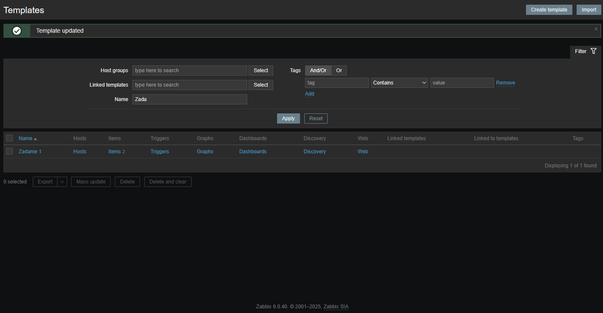
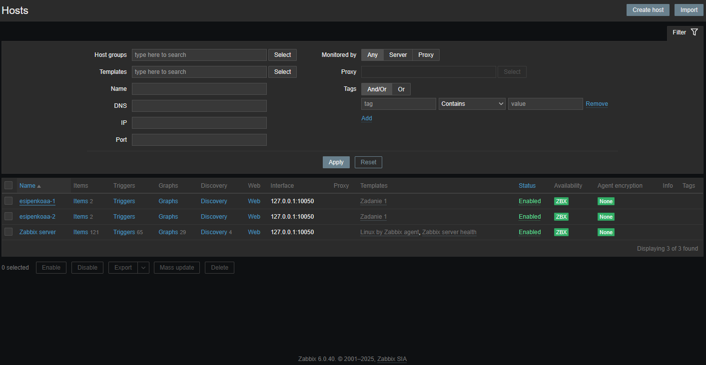
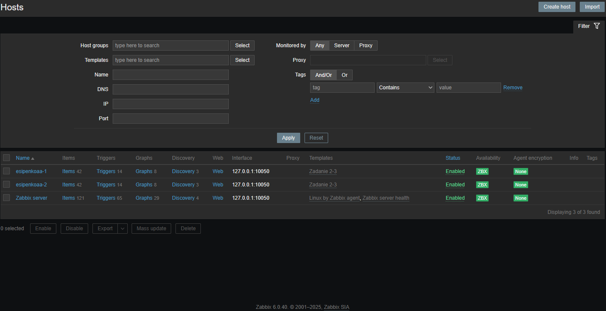

# 📊 Домашнее задание к занятию "Система мониторинга Zabbix"

  

## 📋 Содержание
- [Задание 1: Создание шаблона мониторинга](#задание-1-создание-шаблона-мониторинга)
- [Задание 2-3: Настройка хостов и шаблонов](#задание-2-3-настройка-хостов-и-шаблонов)
- [Задание 4: Создание дашборда](#задание-4-создание-дашборда)

---

## 🚀 Задание 1: Создание шаблона мониторинга

В рамках первого задания был создан шаблон мониторинга с названием "Задание 1". Шаблон содержит необходимые метрики для отслеживания состояния системы.

---

## 🔍 Задание 2-3: Настройка хостов и шаблонов

### Настройка хостов

В рамках второго задания были настроены хосты для мониторинга. Для хостов был применен ранее созданный шаблон "Задание 1". Также были изменены названия хостов для более удобной идентификации.

### Настройка шаблона Linux by Zabbix Agent

В третьем задании был создан клон стандартного шаблона "Linux by Zabbix Agent" и переименован в "Задание 2-3". Это позволило настроить мониторинг с использованием предустановленных метрик Zabbix.

---

## 📈 Задание 4: Создание дашборда

В рамках четвертого задания был создан информативный дашборд с названием "Задание 4" для визуализации данных мониторинга. Дашборд позволяет наглядно отслеживать ключевые показатели работы системы.

### ✅ Результаты выполнения заданий

- Создан шаблон мониторинга с необходимыми метриками
- Настроены хосты для мониторинга с применением созданного шаблона
- Клонирован и настроен стандартный шаблон Linux by Zabbix Agent
- Создан информативный дашборд для визуализации данных мониторинга

---

  
<i>Выполнено в рамках обучения по программе "Мониторинг и отказоустойчивость"</i>

