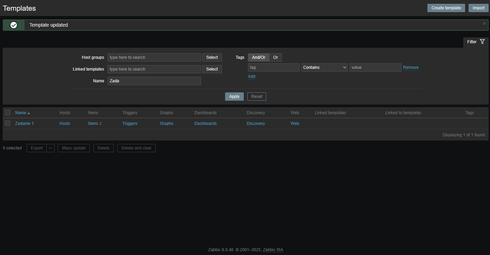
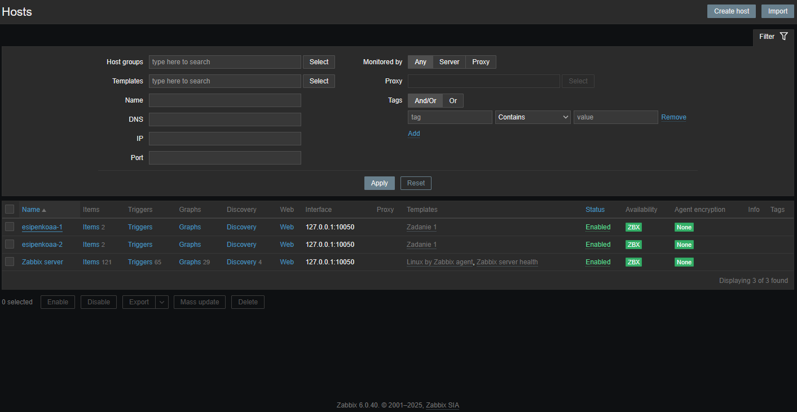
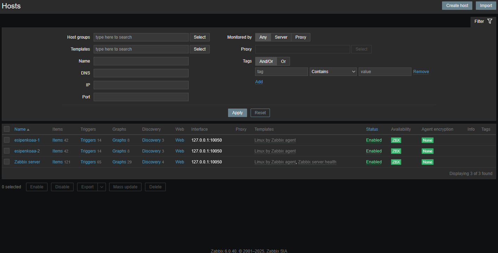
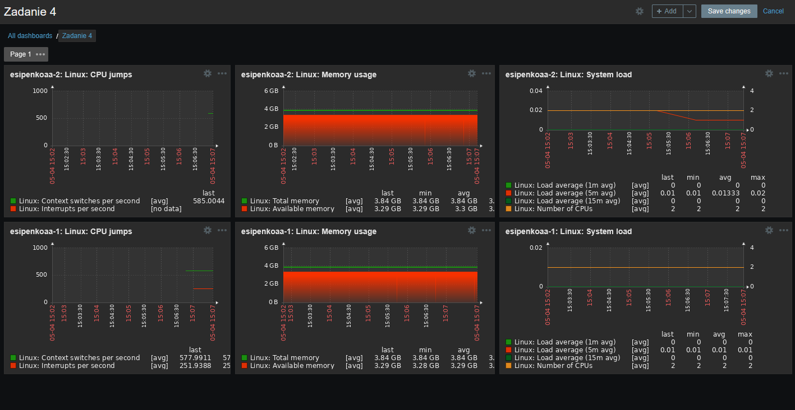

# 📊 Домашнее задание к занятию "Система мониторинга Zabbix"

  

## 📋 Содержание
- [Задание 1: Создание шаблона мониторинга](#задание-1-создание-шаблона-мониторинга)
- [Задание 2: Настройка хостов](#задание-2-настройка-хостов)
- [Задание 3: Настройка шаблона Linux by Zabbix Agent](#задание-3-настройка-шаблона-linux-by-zabbix-agent)
- [Задание 4: Создание дашборда](#задание-4-создание-дашборда)

---

## 🚀 Задание 1: Создание шаблона мониторинга

В рамках первого задания был создан шаблон мониторинга с названием "Задание 1". Шаблон содержит необходимые метрики для отслеживания состояния системы.

---

## 🔍 Задание 2: Настройка хостов

В рамках второго задания были настроены хосты для мониторинга. Для хостов был применен ранее созданный шаблон "Задание 1". Также были изменены названия хостов для более удобной идентификации.

---

## 🖥️ Задание 3: Настройка шаблона Linux by Zabbix Agent

В рамках третьего задания был настроен стандартный шаблон "Linux by Zabbix Agent". Из-за совпадения метрик с ранее созданным шаблоном "Задание 1", было принято решение использовать только один из шаблонов, чтобы избежать дублирования данных.

---

## 📈 Задание 4: Создание дашборда

В рамках четвертого задания был создан информативный дашборд с названием "Задание 4" для визуализации данных мониторинга. Дашборд позволяет наглядно отслеживать ключевые показатели работы системы.

---

  
<i>Выполнено в рамках обучения по программе "Мониторинг и отказоустойчивость"</i>

