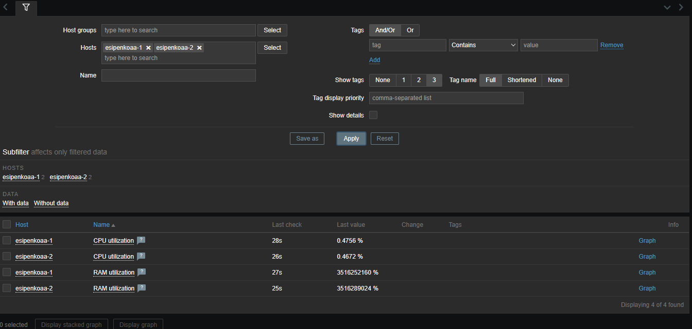

# Домашнее задание к занятию "Система мониторинга Zabbix"

## Задание 1: Установка Zabbix Server

В рамках данного задания был установлен и настроен Zabbix Server.

### Шаблон мониторинга
Создан шаблон для мониторинга системных ресурсов:

## Задание 2-3: Настройка мониторинга

### Серверы
Добавлены серверы для мониторинга:

### Настройка шаблонов

#### Шаблон мониторинга RAM
Настроен шаблон для мониторинга использования оперативной памяти:

#### Шаблон мониторинга CPU
Настроен шаблон для мониторинга загрузки процессора:

### Мониторинг виртуальных машин
Настроен мониторинг виртуальных машин:

> **Примечание:** Не удалось установить шаблон "Linux by Zabbix Agent" вместе с моим шаблоном. Приходилось переключать их по очереди.

## Задание 4: Создание дашборда

### Дашборд
Создан дашборд для визуализации данных мониторинга:

