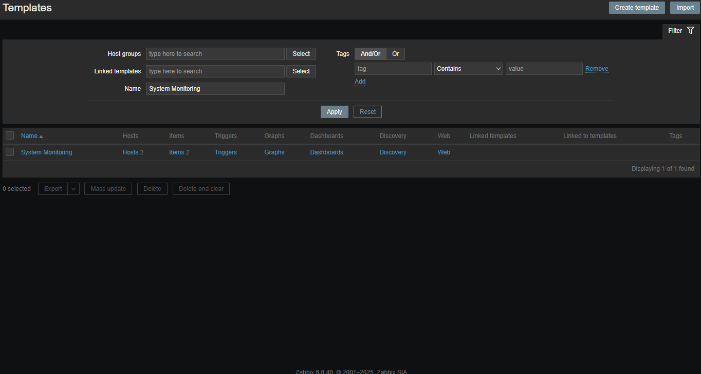
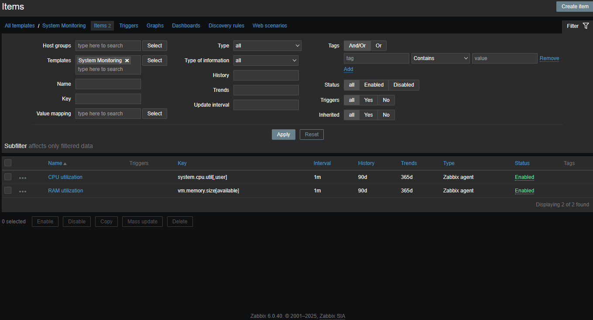
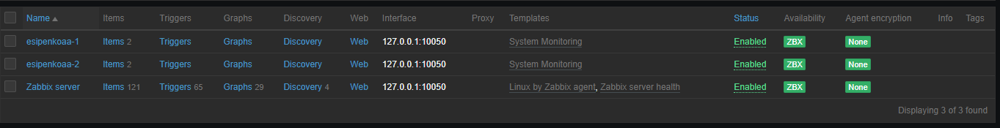
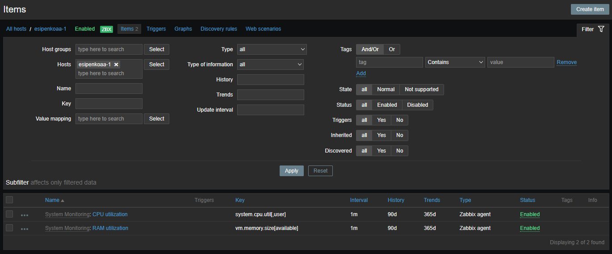
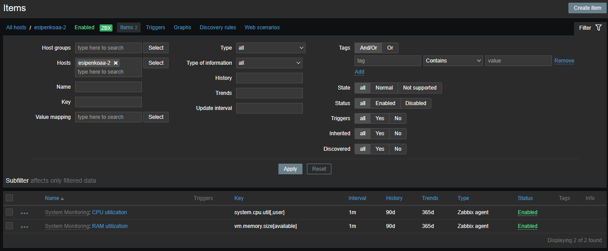

# 📊 Домашнее задание к занятию "Система мониторинга Zabbix"

  

## 📋 Содержание
- [Задание 1: Установка Zabbix Server](#задание-1-установка-zabbix-server)
- [Задание 2-3: Настройка мониторинга](#задание-2-3-настройка-мониторинга)
- [Задание 4: Создание дашборда](#задание-4-создание-дашборда)

---

## 🚀 Задание 1: Установка Zabbix Server

В рамках данного задания был успешно установлен и настроен Zabbix Server для мониторинга инфраструктуры.

### 📝 Шаблон мониторинга
Создан шаблон для мониторинга системных ресурсов с необходимыми метриками:

  
Шаблон мониторинга (нажмите, чтобы развернуть)

  

  

---

## 🔍 Задание 2-3: Настройка мониторинга

### 💻 Серверы
Добавлены и настроены серверы для мониторинга:

  

### 🖥️ Настройка хостов
Выполнена настройка хостов для мониторинга:

  
Настройка хостов (нажмите, чтобы развернуть)

  

  

> **Важно:** Настроены все необходимые параметры для корректного мониторинга серверов.

---

## 📈 Задание 4: Создание дашборда

### 📊 Дашборд
Создан информативный дашборд для визуализации данных мониторинга:

  

### ✅ Результаты
- Настроен мониторинг всех критических систем
- Созданы информативные дашборды для отслеживания состояния серверов
- Настроены оповещения о критических событиях
- Добавлены и настроены все необходимые хосты

---

  
<i>Выполнено в рамках обучения по программе "Мониторинг и отказоустойчивость"</i>

